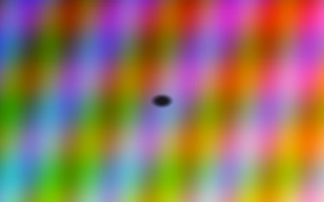
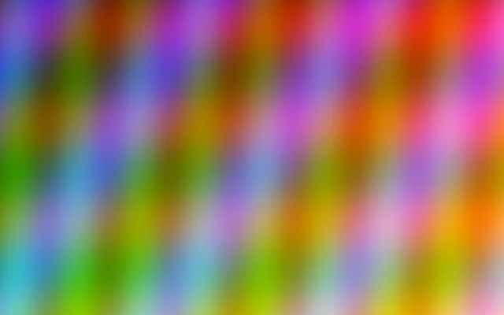
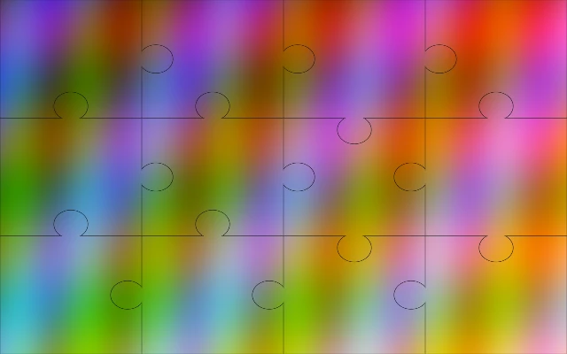
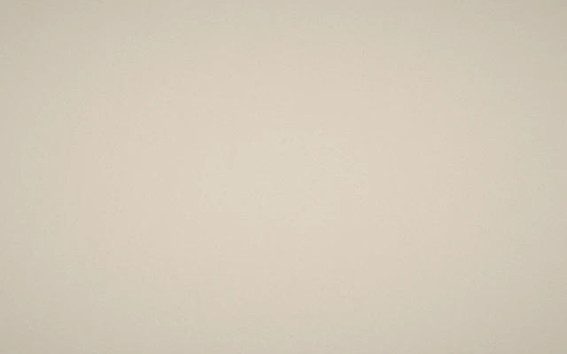
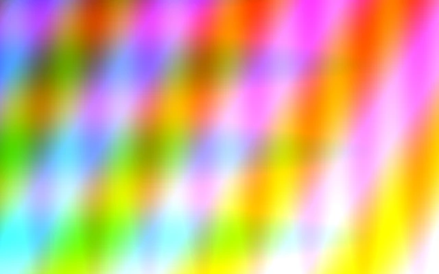
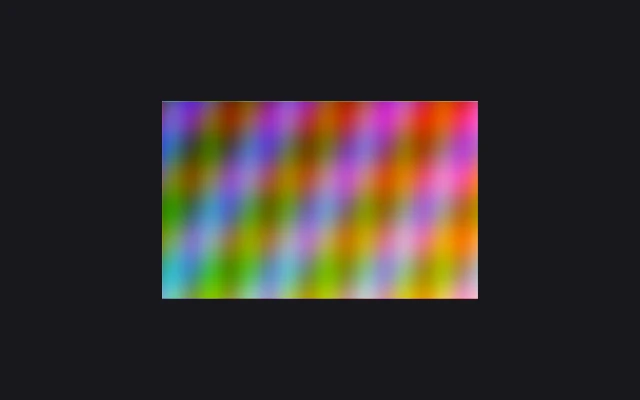
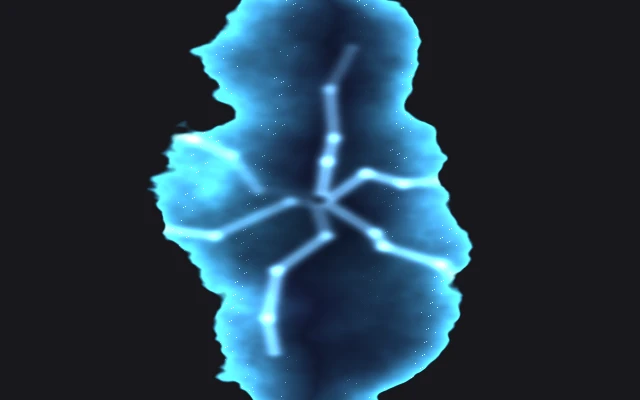
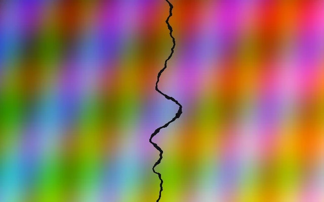

# niri-shaders

Custom animation shaders for the [niri](https://github.com/niri-wm/niri) Wayland compositor.

## Themes

### CRT
Classic CRT monitor power-on/power-off with center dot, scanlines, jitter, and barrel distortion.

| Open | Close |
|------|-------|
|  |  |

### Black Hole
Gravitational singularity with lensing, spaghettification, accretion disk, and event horizon.

| Open | Close |
|------|-------|
|  |  |

### VHS Tape
Analog VHS with tracking drift, horizontal tearing, chromatic aberration, and static noise.

| Open | Close |
|------|-------|
|  |  |

### Smoke Rise
Window dissolves into rising smoke using fractal Brownian motion turbulence.

| Open | Close |
|------|-------|
|  |  |

### Jigsaw
Puzzle pieces with SDF-based interlocking tabs/sockets, 3D rotation, and staggered timing.

| Open | Close |
|------|-------|
|  |  |

### Polaroid
Instant film development: dark outlines appear first, then sepia, then full color.

| Open | Close |
|------|-------|
|  |  |

### Stained Glass
Cathedral glass shatter with Voronoi tessellation, 3D rotation, jewel-tone tinting, beveled edges, and crack propagation.

| Open | Close |
|------|-------|
|  |  |

### Quantum
Quantum superposition collapse with ghost copies converging, per-copy color tinting, and tunneling glow at boundaries.

| Open | Close |
|------|-------|
|  |  |

### Ink
Curl noise ink dissolution with divergence-free fluid advection, swirling vortex tendrils, and color bleeding.

| Open | Close |
|------|-------|
|  |  |

### Tesseract
4D hypercube unfold with six-plane rotation, double perspective projection, and glowing wireframe edges.

| Open | Close |
|------|-------|
|  |  |

### Rift
Dimensional rift with fractal Lichtenberg tear, cloth curl-back, volumetric raymarched void, and procedural lightning.

| Open | Close |
|------|-------|
|  |  |

## Installation

### Quick install

```sh
./install.sh <theme>
```

Available themes: `crt`, `blackhole`, `vhs`, `smoke`, `jigsaw`, `polaroid`, `stained-glass`, `quantum`, `ink`, `tesseract`, `rift`

The script backs up your config, replaces the `animations` block, and validates with `niri validate`. If validation fails, the backup is restored.

### Manual install

Copy the shader code from a theme's `open.frag` and/or `close.frag` into your `~/.config/niri/config.kdl`:

```kdl
animations {
    window-open {
        duration-ms 800
        curve "linear"
        custom-shader r"
            // paste open.frag contents here
        "
    }

    window-close {
        duration-ms 800
        curve "linear"
        custom-shader r"
            // paste close.frag contents here
        "
    }
}
```

Check each theme's `theme.conf` for recommended duration and curve values.

## Rendering previews

Previews are rendered offline using a standalone GLSL renderer:

```sh
# Render all themes
uv run --project preview preview/render.py

# Render one theme
uv run --project preview preview/render.py smoke

# Custom settings
uv run --project preview preview/render.py crt -i photo.png -W 640 -H 400 -f 60 --fps 30
```

## Notes

Custom shaders in niri do not have a backwards compatibility guarantee. The shader interface may change in future niri versions.

If a shader fails to compile, niri falls back to the default animation. Check logs with:

```sh
journalctl -ef /usr/bin/niri
```
