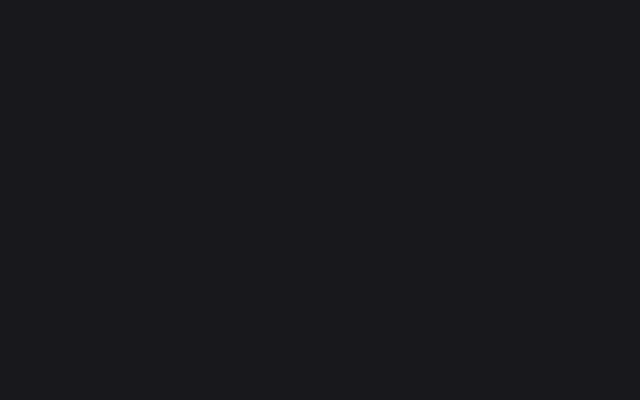
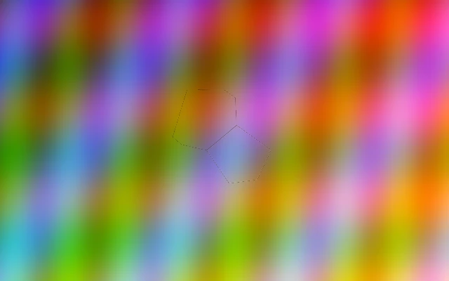

# Stained Glass

Cathedral stained glass shatter effect for niri window animations.

## Preview

| Open | Close |
|------|-------|
|  |  |

## Features

- Voronoi tessellation for irregular glass shard shapes
- 3D rotation with ray-plane intersection for proper perspective
- Beveled glass edges with specular highlights
- Per-shard colored glass tint
- Lead framework with golden glow between pieces
- Crack propagation from center with bright flash along fractures
- Gravity-based tumbling with spin acceleration
- Rim lighting on falling shards
- 3D diffuse + specular lighting that shifts as shards rotate

## Usage

Add to your `~/.config/niri/config.kdl`:

```kdl
animations {
    window-open {
        duration-ms 800
        curve "linear"
        custom-shader r"
            // paste contents of open.frag here
        "
    }

    window-close {
        duration-ms 600
        curve "linear"
        custom-shader r"
            // paste contents of close.frag here
        "
    }
}
```

Or use the install script:

```sh
./install.sh stained-glass
```
